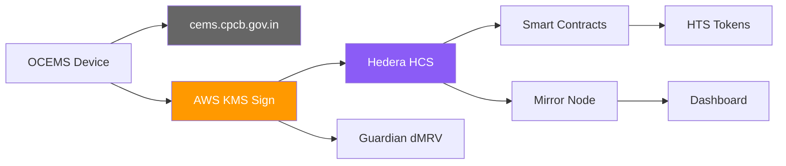
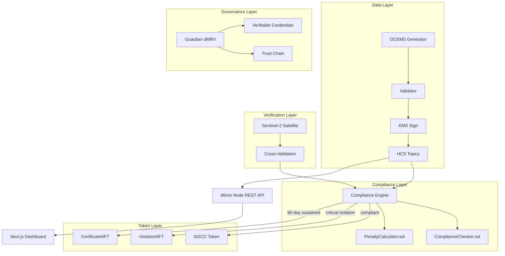

# Project Zeno

Blockchain-verified industrial effluent compliance for India's rivers. Built on [Hedera](https://hedera.com) for the [Hello Future Apex Hackathon 2026](https://hackathon.stackup.dev/web/events/hedera-hello-future-apex-hackathon-2026).

## Problem

India's CPCB mandates OCEMS monitoring for 4,433 Grossly Polluting Industries. The data is self-reported and tamperable — 1,686 GPIs operate without monitoring, 9 documented tampering methods exist, and 60,000 tonnes of chromium flow into the Ganga from Kanpur annually (840x legal limit).

No independent party can verify monitoring data hasn't been altered between device and regulator.

## Solution

Zeno is a parallel blockchain trust layer alongside CPCB's existing infrastructure. It doesn't replace the regulatory system — it makes it auditable and tamper-proof.



Every compliance token traces back through: facility registration -> sensor data -> compliance evaluation -> KMS proof -> satellite cross-validation.

## Architecture



### Hedera Services (7)

| Service | Role |
|---------|------|
| **HCS** | Multi-topic sensor data + compliance results |
| **HTS** | GGCC (compliance credit), ViolationNFT, CertificateNFT |
| **Smart Contracts** | On-chain compliance verification + penalty calculation |
| **Guardian** | dMRV policy engine with 5-role workflow |
| **Mirror Node** | REST API powering dashboard (no external DB) |
| **AWS KMS** | HSM-backed ECDSA device signing |
| **Agent Kit** | AI compliance agent |

## Project Structure

```
zeno/
├── apps/web/                  # Next.js 16 dashboard
├── packages/
│   ├── blockchain/            # Hedera SDK layer (HCS, HTS, KMS, compliance)
│   ├── simulator/             # OCEMS data generator (10 facilities, 8 scenarios)
│   ├── contracts/             # Solidity (ComplianceChecker + PenaltyCalculator)
│   └── satellite/             # Sentinel-2 water quality API (Python/FastAPI)
├── guardian/                  # Guardian dMRV policy + scripts
├── scripts/                   # E2E pipeline test (38 assertions, real testnet)
└── docs/aws-kms/              # KMS architecture (AWS bounty)
```

Each package has its own README with details.

## Quick Start

```bash
git clone https://github.com/akash-mondal/zeno.git
cd zeno && npm install
cp .env.example .env  # fill in Hedera + AWS credentials

npx turbo run build
npx tsx scripts/e2e-pipeline.ts          # full E2E (real testnet)
npx tsx packages/blockchain/scripts/kms-demo.ts  # KMS demo
npm run dev -w apps/web                  # dashboard
```

## Testnet Resources

| Resource | ID |
|----------|----|
| Operator | [`0.0.7284970`](https://hashscan.io/testnet/account/0.0.7284970) |
| KMS Account | [`0.0.8148249`](https://hashscan.io/testnet/account/0.0.8148249) |
| GGCC Token | [`0.0.8144733`](https://hashscan.io/testnet/token/0.0.8144733) |
| ViolationNFT | [`0.0.8144734`](https://hashscan.io/testnet/token/0.0.8144734) |
| CertificateNFT | [`0.0.8144735`](https://hashscan.io/testnet/token/0.0.8144735) |
| Contracts | See `deployments/testnet.json` |

## Tech Stack

| Layer | Tech |
|-------|------|
| Blockchain | `@hashgraph/sdk` 2.80.0 |
| Guardian | 3.5.0 (self-hosted) |
| Signing | AWS KMS (ECC_SECG_P256K1, FIPS 140-2 L3) |
| Frontend | Next.js 16.1.6, shadcn/ui, React-Leaflet, Recharts |
| Contracts | Hardhat 3.1.11, Solidity 0.8.24 |
| Satellite | Google Earth Engine, Sentinel-2 Se2WaQ |
| Build | Turborepo 2.8.14, npm workspaces |

## License

[MIT](LICENSE)
