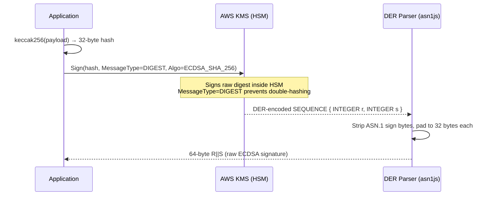

# AWS KMS Integration for Hedera — Project Zeno

Hardware Security Module (HSM) key management for industrial OCEMS sensor devices submitting effluent compliance data to the Hedera network.

## Architecture Overview

Private keys **never leave the AWS HSM** (FIPS 140-2 Level 3). Only 32-byte keccak256 digests are sent to KMS for signing. Verification is performed locally with the public key — no KMS call required.

```
KMS Key: 907fbc7e-3555-46e9-a8b0-dbdf9b84d35b (ECC_SECG_P256K1)
KMS Account: 0.0.8148249 (Hedera testnet)
IAM User: hedera-kms-user
```

```mermaid
flowchart LR
    subgraph "OCEMS Device"
        A[Sensor Reading] --> B[keccak256 Hash]
    end

    subgraph "AWS KMS (HSM)"
        C[Sign Digest]
        D[Private Key<br/>NEVER exported]
    end

    subgraph "Hedera Network"
        E[HCS Topic]
        F[Mirror Node]
    end

    B -- "32-byte digest" --> C
    C -- "DER signature" --> G[Parse R||S]
    G --> E
    E --> F

    style D fill:#ff6b6b,color:#fff
    style C fill:#ffa94d
```

## Two Signing Layers

Zeno uses **two independent signing layers**, each serving a distinct security purpose.

### Layer 1: Transaction-Level Signing (`setOperatorWith`)

Authenticates every Hedera transaction (transfers, HCS submissions) so the network accepts them as originating from the KMS-controlled account.

```typescript
// Workshop pattern — SDK calls signer internally for each transaction
const signer = buildKMSSigner(kmsClient, keyId);
client.setOperatorWith(accountId, publicKey, signer);

// Now every transaction on this client is KMS-signed automatically
const tx = new TransferTransaction()
  .addHbarTransfer(kmsAccountId, Hbar.fromTinybars(-100000))
  .addHbarTransfer(recipientId, Hbar.fromTinybars(100000));
await tx.execute(client); // SDK invokes KMS signer under the hood
```

**Source:** `createKMSSignedClient()` and `buildKMSSigner()` in `kms-signer.ts`

### Layer 2: Payload-Level Signing (`signReadingPayload`)

Proves a specific OCEMS device produced a specific reading. Without this, anyone with the operator key could submit fabricated readings to HCS. With this, only the device's KMS key can produce valid signatures.

```typescript
// Application-layer signature — covers the reading content itself
const sigHex = await signReadingPayload(sensorReading, kmsClient, keyId);
sensorReading.kmsSigHash = sigHex;

// Anyone can verify locally (no KMS call needed)
const valid = verifyReadingSignature(sensorReading, publicKeyHex);
```

Batch signing is also supported — one KMS call covers an entire batch of readings via `signBatchPayload()`, which hashes each reading individually then hashes the concatenated hashes.

**Source:** `signReadingPayload()`, `signBatchPayload()`, `verifyReadingSignature()` in `kms-signer.ts`

## Key Conversion: DER SPKI to Hedera PublicKey

AWS KMS returns public keys in DER-encoded SPKI format (88 bytes). Hedera needs a 33-byte compressed secp256k1 key.

```
KMS Response (88 bytes, DER SPKI):
┌──────────────────────────────┬──────────────────────────────────────────┐
│  23-byte DER header          │  65-byte uncompressed key (04 || x || y)│
│  3056301006072a8648ce3d0201  │  04 + 32-byte X + 32-byte Y            │
│  06052b8104000a034200        │                                         │
└──────────────────────────────┴──────────────────────────────────────────┘
                                         │
                                    Strip header
                                         │
                                         ▼
                              Compress with elliptic
                              65 bytes → 33 bytes (02/03 || x)
                                         │
                                         ▼
                           PublicKey.fromBytesECDSA(compressed)
```

**Implementation:**

```typescript
const derHex = Buffer.from(response.PublicKey).toString('hex');
// Verify and strip the fixed 23-byte header
const rawUncompressedHex = derHex.slice(DER_SPKI_HEADER_HEX.length);
// Compress: 04||x||y → 02/03||x
const key = ec.keyFromPublic(rawUncompressedHex, 'hex');
const compressedHex = key.getPublic(true, 'hex');
return PublicKey.fromBytesECDSA(Buffer.from(compressedHex, 'hex'));
```

**Source:** `getHederaPublicKeyFromKMS()` in `kms-signer.ts`

## Signing Flow: keccak256 to R||S



**Why `MessageType: DIGEST` is critical:** We pre-hash with keccak256 (required by Hedera's ECDSA/secp256k1). If `MessageType` were `RAW`, KMS would SHA-256 the input again, producing an invalid signature.

**DER signature parsing:** KMS returns ASN.1 DER `SEQUENCE { INTEGER r, INTEGER s }`. R and S integers may have a leading `0x00` (ASN.1 sign byte) or be fewer than 32 bytes. The parser strips leading zeros and left-pads to exactly 32 bytes each, producing the 64-byte `R||S` format Hedera expects.

**Source:** `buildKMSSigner()` and `parseDERSignature()` in `kms-signer.ts`

## IAM Security

The `hedera-kms-user` IAM user has **least-privilege** access — only three KMS actions are permitted:

```json
{
  "Version": "2012-10-17",
  "Statement": [
    {
      "Effect": "Allow",
      "Action": [
        "kms:Sign",
        "kms:GetPublicKey",
        "kms:DescribeKey"
      ],
      "Resource": "arn:aws:kms:us-east-1:*:key/907fbc7e-3555-46e9-a8b0-dbdf9b84d35b"
    }
  ]
}
```

| Permission | Purpose | Used By |
|---|---|---|
| `kms:Sign` | Sign transaction digests and reading payloads | `buildKMSSigner()`, `signReadingPayload()`, `signBatchPayload()` |
| `kms:GetPublicKey` | Extract public key for Hedera account creation and verification | `getHederaPublicKeyFromKMS()` |
| `kms:DescribeKey` | Validate key spec (ECC_SECG_P256K1) and key state | `kms-demo.ts` Step 1 |

**What is explicitly denied by omission:**

- `kms:CreateKey` — no new keys can be created
- `kms:Decrypt` / `kms:Encrypt` — key is SIGN_VERIFY only, not encryption
- `kms:ScheduleKeyDeletion` — key cannot be deleted
- `kms:PutKeyPolicy` — IAM policy cannot be escalated
- `kms:CreateGrant` — no delegation of permissions

## CloudTrail Audit Logging

Every KMS API call is automatically logged by AWS CloudTrail with:

- **Timestamp** (UTC)
- **Caller identity** (IAM user ARN)
- **Key ID** used
- **Source IP address**
- **API action** (Sign, GetPublicKey, DescribeKey)

Query recent signing events:

```bash
aws cloudtrail lookup-events \
  --lookup-attributes AttributeKey=EventName,AttributeValue=Sign \
  --max-results 10
```

This creates a tamper-proof audit trail: for every OCEMS reading on Hedera, there is a corresponding CloudTrail entry proving which IAM identity authorized the signature, from which IP, at what time. Regulators can cross-reference HCS message timestamps with CloudTrail logs.

## Cost Analysis at Scale

**KMS pricing** (us-east-1, as of March 2026):

| Item | Cost |
|---|---|
| KMS key (per month) | $1.00 |
| Sign request | $0.03 per 10,000 |
| GetPublicKey request | $0.03 per 10,000 |

**Zeno scale projection — 4,433 GPIs (Grossly Polluting Industries) across India:**

| Scenario | Sign Calls/Month | Monthly Cost | Notes |
|---|---|---|---|
| Per-reading signing | 4,433 GPIs x 24h x 4/hr = 425,568 | $1.28 + $1.00 key = **$2.28** | Every 15-min reading signed individually |
| Batch signing (hourly) | 4,433 GPIs x 24h = 106,392 | $0.32 + $1.00 key = **$1.32** | 4 readings per batch, 1 KMS call/batch |
| Batch signing (daily) | 4,433 | $0.01 + $1.00 key = **$1.01** | 96 readings per batch |

Even at maximum granularity (per-reading, all 4,433 GPIs), KMS costs **under $3/month**. This is negligible compared to Hedera transaction fees.

**Per-device KMS keys** (one key per GPI for device-level attestation):

| Item | Monthly Cost |
|---|---|
| 4,433 KMS keys | $4,433.00 |
| Sign calls (per-reading) | $1.28 |
| **Total** | **$4,434.28** |

For production, a single KMS key with batch signing is recommended, combined with device serial numbers in the payload for per-device identification.

## Standalone Demo

Run the demo script to verify the full integration end-to-end:

```bash
cd packages/blockchain
npx tsx scripts/kms-demo.ts
```

**Prerequisites:**

```bash
# .env file at project root
HEDERA_ACCOUNT_ID=0.0.xxxxx       # Operator account
HEDERA_PRIVATE_KEY=302e...         # Operator private key
AWS_ACCESS_KEY_ID=AKIA...          # hedera-kms-user credentials
AWS_SECRET_ACCESS_KEY=...
AWS_REGION=us-east-1
KMS_KEY_ID=907fbc7e-3555-46e9-a8b0-dbdf9b84d35b
KMS_ACCOUNT_ID=0.0.8148249        # Pre-created KMS-backed account
```

**Demo steps** (all on Hedera testnet):

1. Verify KMS key configuration (ECC_SECG_P256K1, SIGN_VERIFY, enabled)
2. Extract and convert public key (DER SPKI to compressed Hedera format)
3. Create or verify KMS-backed Hedera account
4. KMS-signed HBAR transfer (proves transaction signing works)
5. KMS-signed HCS message with real OCEMS sensor data
6. CloudTrail audit verification instructions
7. Cryptographic proof: account public key === KMS public key

**Source:** `packages/blockchain/scripts/kms-demo.ts`

## File Reference

| File | Purpose |
|---|---|
| `packages/blockchain/src/kms-signer.ts` | Core KMS integration — key extraction, signing, verification |
| `packages/blockchain/scripts/kms-demo.ts` | Standalone end-to-end demo for the AWS bounty |
| `packages/blockchain/src/client.ts` | Hedera client setup (used by `createKMSAccount`) |
| `packages/blockchain/src/trust-chain.ts` | Data pipeline that calls `signReadingPayload` |

## Dependencies

- `@aws-sdk/client-kms` — AWS KMS SDK
- `@hashgraph/sdk` — Hedera SDK (`setOperatorWith` for custom signers)
- `js-sha3` — keccak256 hashing (Hedera ECDSA requirement)
- `asn1js` v3 — DER signature parsing
- `elliptic` — secp256k1 key compression and local signature verification
