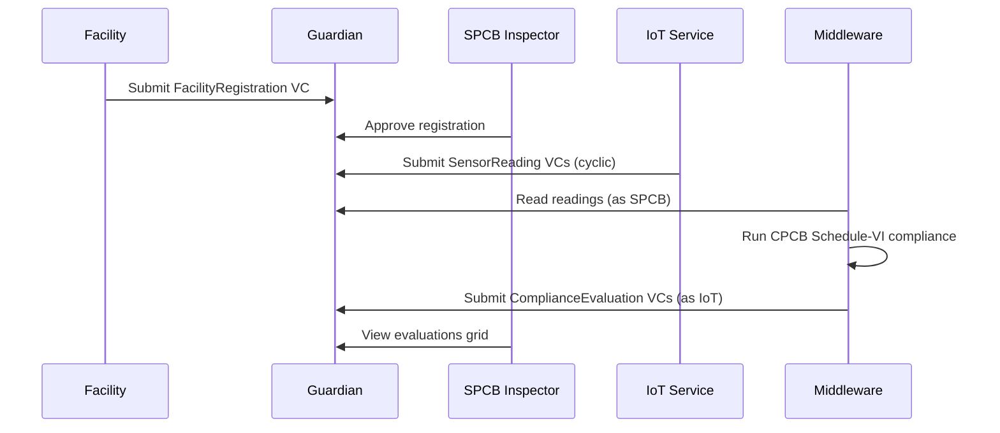

# Guardian dMRV Policy

Governance and VC orchestration layer for Zeno. Manages the digital MRV lifecycle: facility registration, SPCB approval, sensor data intake, compliance evaluation, and trust chain.

Self-hosted on DigitalOcean (`165.22.212.120`), Guardian 3.5.0.

## How It Works



Guardian saves VCs and provides grids/trust chain. Compliance evaluation is handled by middleware (not in-policy) because Guardian's `customLogicBlock` and `calculateContainerBlock` don't auto-execute reliably via events.

## Roles

| Role | What they do |
|------|-------------|
| **Standard Registry** (CPCB) | Publishes methodology, trust chain |
| **Facility** | Submits registration, views compliance |
| **SPCB** | Approves registrations, monitors readings + evaluations |
| **VVB** | Reviews flagged violations |
| **IoT** | Submits sensor readings + compliance evaluations |

## Schemas (4 VC types)

| Schema | Fields | Purpose |
|--------|--------|---------|
| FacilityRegistration | 17 | Facility identity, CTO, OCEMS device, KMS key |
| SensorReading | 16 | 9 CPCB Schedule-VI parameters + KMS signature |
| ComplianceEvaluation | 21 | Per-parameter compliance flags + token action |
| SatelliteValidation | 7 | Sentinel-2 NDTI/NDCI cross-validation |

## Scripts

| Script | Purpose |
|--------|---------|
| `deploy-selfhosted.py` | Full policy deployment (schemas, tokens, blocks) |
| `update-blocks.py` | Quick block-only update (no schema recreation) |
| `test-dry-run.py` | E2E dry-run test: register -> approve -> 5 readings -> 5 evaluations |
| `middleware-compliance.py` | Reads SensorReading VCs, runs compliance, submits evaluations |

### Running

```bash
# Deploy policy
python3 guardian/scripts/deploy-selfhosted.py

# Test full pipeline
python3 guardian/scripts/test-dry-run.py

# Run compliance middleware (one-shot or continuous)
python3 guardian/scripts/middleware-compliance.py
python3 guardian/scripts/middleware-compliance.py --continuous
```

## Policy Instance

| Item | Value |
|------|-------|
| Policy ID | `69b2891d42d30f9a24fc9a18` |
| GGCC Token | `0.0.8182260` |
| ZVIOL Token | `0.0.8182266` |
| Guardian URL | `http://165.22.212.120:3000/api/v1` |

## Directory

```
guardian/
├── schemas/                    # 4 JSON Schema Draft 7 VC schemas
├── policies/
│   ├── selfhosted-config.json  # Schema IRIs + token IDs
│   └── zeno-dmrv-v1.policy.json
└── scripts/                    # Deploy, test, middleware
```

## Key Learnings

- Only `requestVcDocumentBlock` accepts data via tag API POST. Other blocks return 422.
- `interfaceStepBlock` with `cyclic=True` works if there's no terminal `informationBlock`.
- Schemas must be on the same HCS topic as the policy.
- `documentsSourceAddon.filters` must be an array `[]`, not an object.
- Dry-run: `PUT /dry-run` needs no body and no Content-Type header.
- Virtual users start as `NO_ROLE` — must select role via `policyRolesBlock`.
