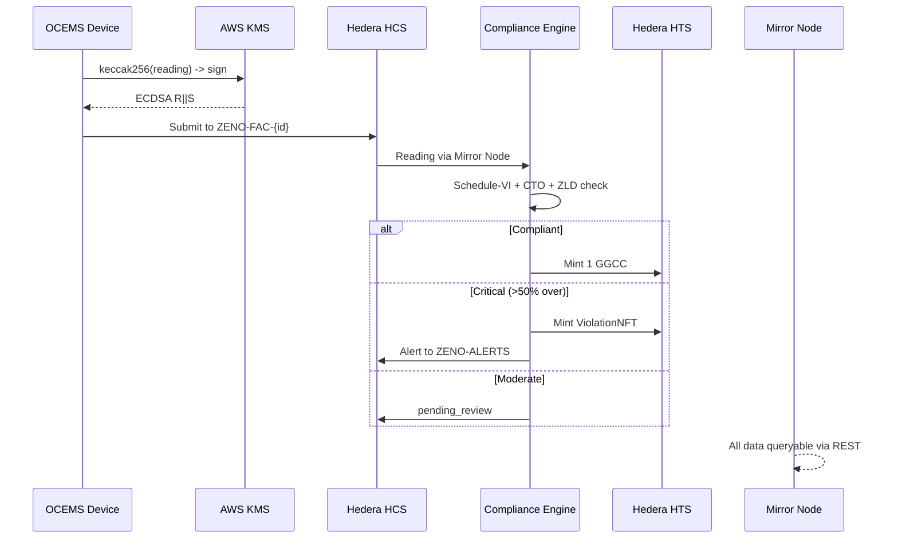
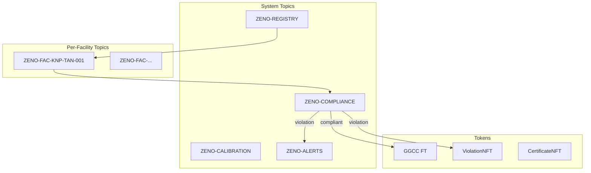
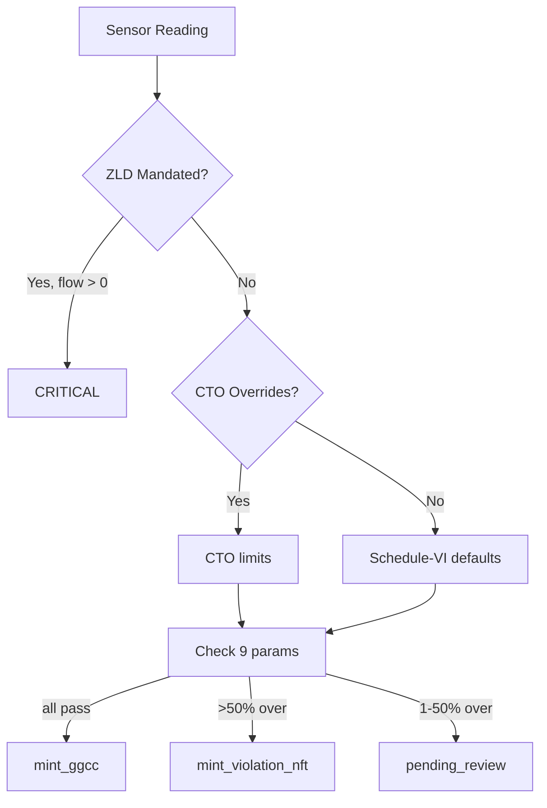

# @zeno/blockchain

Hedera base layer. Single source of truth for all on-chain interactions — every other package depends on this.

## Data Flow



## HCS Topic Architecture



## Compliance Evaluation



### Schedule-VI Limits

| Parameter | Limit | Tolerance |
|-----------|-------|-----------|
| pH | 5.5 – 9.0 | +/-0.2 |
| BOD | <= 30 mg/L | +/-10% |
| COD | <= 250 mg/L | +/-10% |
| TSS | <= 100 mg/L | +/-10% |
| Temperature | <= 40C | -- |
| Total Cr | <= 2.0 mg/L | -- |
| Hex Cr | <= 0.1 mg/L | -- |
| Oil & Grease | <= 10 mg/L | -- |
| NH3-N | <= 50 mg/L | -- |

## Modules

| Module | Purpose |
|--------|---------|
| `types.ts` | Interfaces, schemas, CPCB limits, calibration tolerances |
| `client.ts` | Hedera SDK client factory |
| `topics.ts` | Multi-topic HCS architecture with submit keys |
| `hcs.ts` | Envelope-wrapped message submission + typed retrieval |
| `hts.ts` | Token creation (GGCC, ZVIOL, ZCERT) and minting |
| `compliance.ts` | Schedule-VI engine: two-tier limits, ZLD, tolerance bands |
| `trust-chain.ts` | Section 65B evidence package builder |
| `mirror.ts` | Mirror Node REST wrappers with pagination |
| `kms-signer.ts` | Two-layer KMS signing (transaction + payload level) |
| `validator.ts` | Three-tier ingestion validation: range limits, chemistry, flatline/rate-of-change |

### Validator

Three tiers of validation before data reaches HCS:

1. **Single reading** — schema completeness, analyzer range limits, chemistry constraints (COD > BOD, HexCr <= TotalCr), timestamp sanity, KMS signature
2. **Batch** — monotonic timestamps, flatline detection (<5% variation = tampering flag), rate-of-change limits
3. **Quality codes** — each issue mapped to CPCB alert level (red/orange/yellow)

### KMS Signing

Two independent signing layers:

| Layer | Function | Proves |
|-------|----------|--------|
| Transaction | `setOperatorWith(accountId, pubKey, signer)` | Hedera tx authorized by KMS holder |
| Payload | `signReadingPayload(reading)` -> `kmsSigHash` | Specific device produced specific reading |

See [`docs/aws-kms/`](../../docs/aws-kms/) for full KMS architecture.

## Running

```bash
# 8-phase pipeline test (real testnet)
npx tsx packages/blockchain/scripts/test-hedera-pipeline.ts

# KMS demo (AWS bounty)
npx tsx packages/blockchain/scripts/kms-demo.ts
```

## Testnet Resources

| Resource | ID |
|----------|----|
| Operator | `0.0.7284970` |
| KMS Account | `0.0.8148249` |
| GGCC | `0.0.8144733` |
| ViolationNFT | `0.0.8144734` |
| CertificateNFT | `0.0.8144735` |
| ZENO-REGISTRY | `0.0.8144973` |
| ZENO-COMPLIANCE | `0.0.8144974` |
