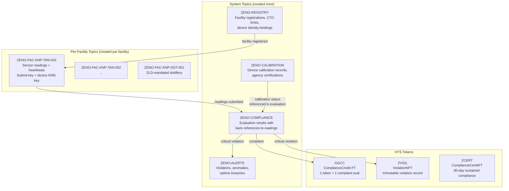
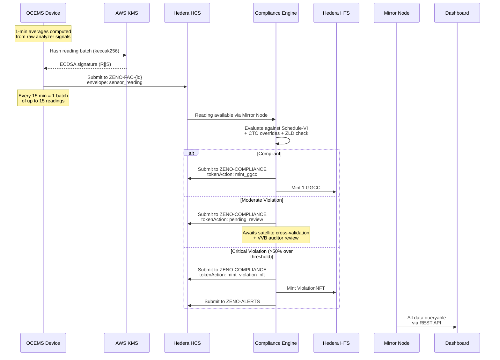
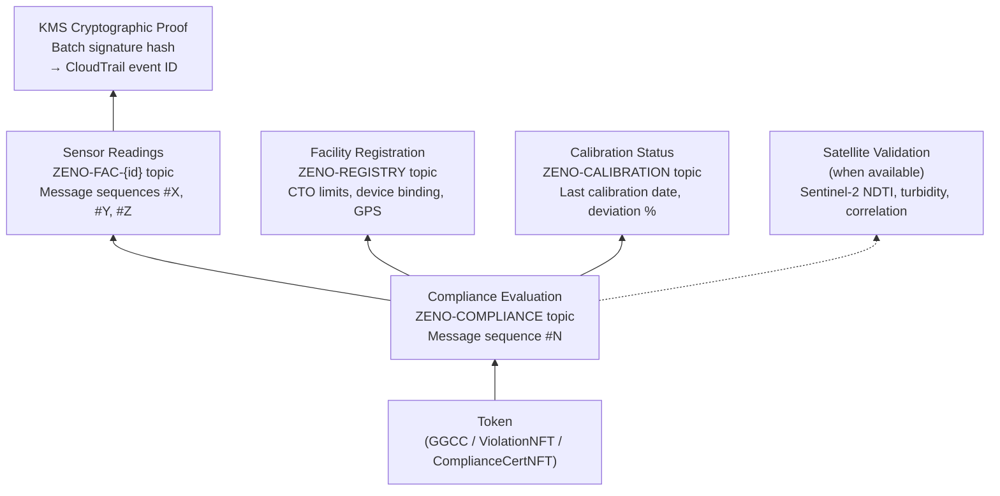
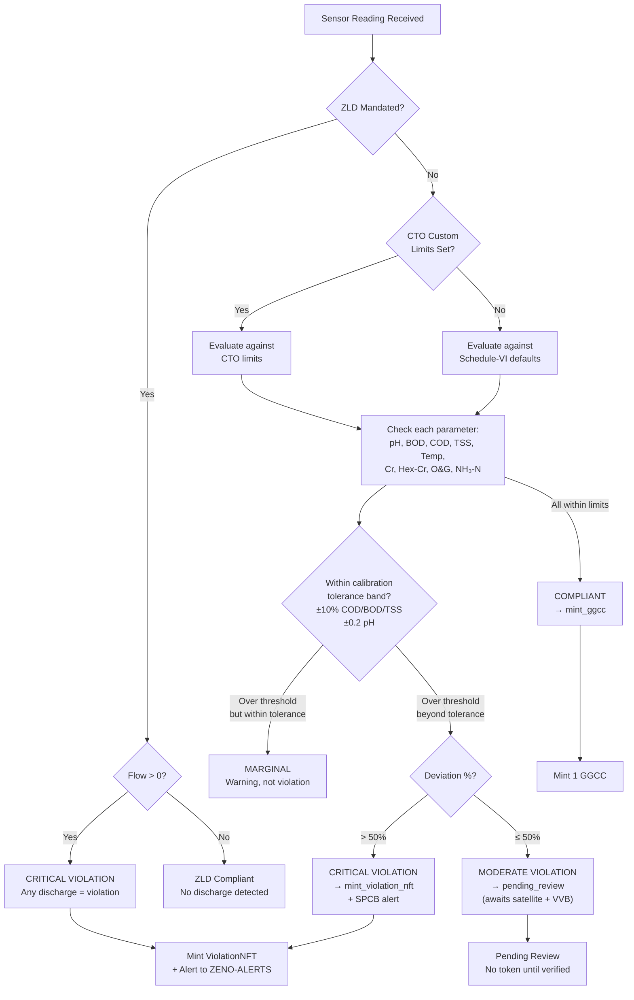

# @zeno/blockchain — Hedera Base Layer

The foundational blockchain integration layer for Project Zeno. This package is the single source of truth for all Hedera interactions — every other package and application in the monorepo depends on it.

**This layer is considered stable.** All interfaces, schemas, and on-chain architectures defined here are production-locked.

---

## Architecture

### Multi-Topic HCS Architecture

Zeno uses a purpose-built multi-topic architecture on Hedera Consensus Service that mirrors the real CPCB OCEMS data flow — from device registration through compliance evaluation to token minting.



### Data Flow — End-to-End Pipeline



### Trust Chain — Token to Raw Data

Every token minted by Zeno is fully traceable back to the raw sensor reading, device identity, and cryptographic proof. This is what gets presented to the NGT as Section 65B evidence.



### Compliance Evaluation Logic



---

## Module Reference

| Module | Purpose |
|--------|---------|
| `types.ts` | All TypeScript interfaces, schema version, CPCB discharge limits, calibration tolerances |
| `client.ts` | Hedera SDK client factory (`Client.forTestnet().setOperator()`) |
| `topics.ts` | Multi-topic architecture — system topics + per-facility topics with submit keys |
| `hcs.ts` | Envelope-wrapped HCS message submission and typed retrieval |
| `hts.ts` | Token creation (GGCC, ViolationNFT, ComplianceCertNFT) and minting |
| `compliance.ts` | CPCB Schedule-VI compliance engine with two-tier limits, ZLD, tolerance bands |
| `trust-chain.ts` | Evidence package builder for NGT/Section 65B compliance |
| `mirror.ts` | Mirror Node REST API typed wrappers with pagination |
| `kms-signer.ts` | AWS KMS signing pipeline (DER parsing, key conversion, custom signer) |
| `validator.ts` | Sensor reading ingestion validation (schema, ranges, chemistry constraints) |

---

## HCS Message Envelope

Every message submitted to any topic is wrapped in a typed envelope:

```json
{
  "v": "1.0.0",
  "type": "sensor_reading",
  "ts": "2026-03-10T09:05:05.372Z",
  "src": "0.0.7284970",
  "payload": { ... }
}
```

Message types: `facility_registration`, `sensor_reading`, `sensor_reading_batch`, `compliance_evaluation`, `calibration_record`, `device_heartbeat`, `violation_alert`

---

## CPCB Standards (Hardcoded)

### Schedule-VI Discharge Limits

| Parameter | Limit | Tolerance |
|-----------|-------|-----------|
| pH | 5.5 – 9.0 | ±0.2 pH units |
| BOD (3-day, 27°C) | ≤ 30 mg/L | ±10% |
| COD | ≤ 250 mg/L | ±10% |
| TSS | ≤ 100 mg/L | ±10% |
| Temperature | ≤ 5°C above ambient | — |
| Total Chromium | ≤ 2.0 mg/L | — |
| Hexavalent Chromium | ≤ 0.1 mg/L | — |
| Oil & Grease | ≤ 10 mg/L | — |
| Ammoniacal Nitrogen | ≤ 50 mg/L | — |

### Violation Severity

| Severity | Condition | Action |
|----------|-----------|--------|
| **None** | Within limits | Mint GGCC |
| **Marginal** | Over limit but within calibration tolerance | Warning only |
| **Moderate** | 1–50% over threshold | Pending review (satellite + VVB) |
| **Critical** | >50% over threshold | Immediate ViolationNFT + SPCB alert |

---

## Testnet Resources

All resources created on Hedera testnet and verified via HashScan:

| Resource | ID | HashScan |
|----------|----|----------|
| Operator Account | `0.0.7284970` | [View](https://hashscan.io/testnet/account/0.0.7284970) |
| ZENO-REGISTRY | `0.0.8144973` | [View](https://hashscan.io/testnet/topic/0.0.8144973) |
| ZENO-COMPLIANCE | `0.0.8144974` | [View](https://hashscan.io/testnet/topic/0.0.8144974) |
| ZENO-CALIBRATION | `0.0.8144975` | [View](https://hashscan.io/testnet/topic/0.0.8144975) |
| ZENO-ALERTS | `0.0.8144976` | [View](https://hashscan.io/testnet/topic/0.0.8144976) |
| Facility Topic (KNP-TAN-001) | `0.0.8144978` | [View](https://hashscan.io/testnet/topic/0.0.8144978) |
| GGCC Token | `0.0.8144733` | [View](https://hashscan.io/testnet/token/0.0.8144733) |
| ViolationNFT | `0.0.8144734` | [View](https://hashscan.io/testnet/token/0.0.8144734) |
| ComplianceCertNFT | `0.0.8144735` | [View](https://hashscan.io/testnet/token/0.0.8144735) |

---

## Running the Pipeline Test

```bash
cd zeno
npx tsx packages/blockchain/scripts/test-hedera-pipeline.ts
```

This runs the full 8-phase pipeline on real testnet:
1. Create system topics
2. Register facility on ZENO-REGISTRY
3. Device heartbeat + calibration record
4. Submit 3 sensor readings + compliance evaluation
5. Mint tokens (GGCC for compliant, ViolationNFT for critical)
6. Violation alert to ZENO-ALERTS
7. Build trust chain evidence package
8. Mirror Node verification of all data
