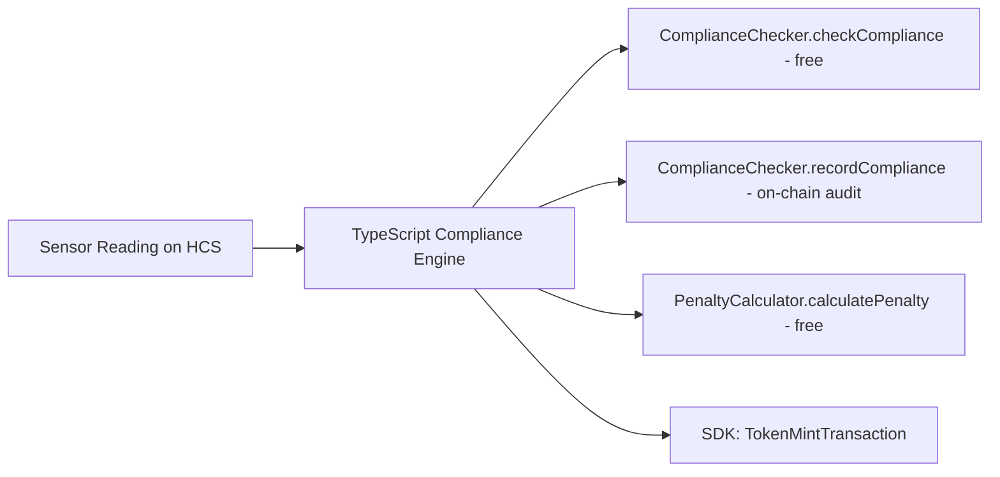

# @zeno/contracts

Solidity smart contracts on Hedera testnet. On-chain compliance verification and penalty calculation.

**Hybrid architecture**: Contracts handle verification (view functions = free). Token minting uses SDK (`packages/blockchain/src/hts.ts`). This matches what DOVU and other Hedera sustainability winners do.

## Contracts

### ComplianceChecker.sol

On-chain compliance oracle + facility registry.

- **Two-tier thresholds**: Schedule-VI defaults + CTO-specific overrides per facility
- **ZLD enforcement**: Any flow > 0 = violation for ZLD-mandated facilities
- **9 parameters**: pH, BOD, COD, TSS, Temp, Total Cr, Hex Cr, O&G, NH3-N
- **Gas-optimized**: uint16 with implicit 1-decimal precision (pH 7.2 -> 72)
- **HTS precompile** at 0x167 for token creation (shows deep Hedera integration)

Key functions: `checkCompliance()` (view/free), `recordCompliance()`, `registerFacility()`

### PenaltyCalculator.sol

Graduated penalty scoring with parameter weights (sum = 1000 basis points):

```
HexCr 20% | TotalCr 15% | COD 15% | BOD 12% | TSS 10% | pH 10% | O&G 8% | NH3-N 5% | Temp 5%
```

Repeat offender multipliers: 1x first -> 1.5x at 3+ -> 2x at 10+ -> 3x at 25+ violations.

## Architecture



## Commands

```bash
npx hardhat compile
npx hardhat test                                    # 41 local tests
npx hardhat run scripts/deploy.ts --network hedera_testnet
npx hardhat run scripts/e2e-test.ts --network hedera_testnet
```
