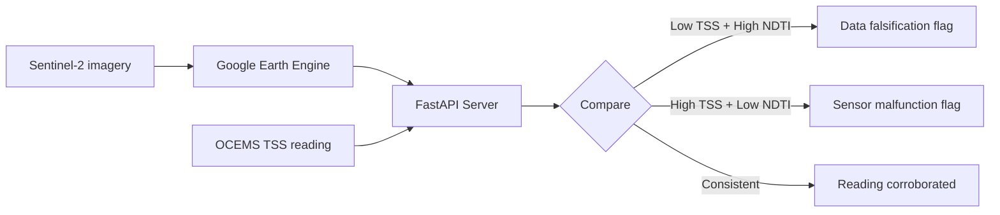

# @zeno/satellite

Sentinel-2 water quality cross-validation for OCEMS readings. The independent verification layer — satellite imagery can't be manipulated by facility operators.

## Core Idea



The key signal is the **upstream-to-downstream NDTI delta**. If NDTI jumps across a discharge zone, that facility is polluting — regardless of what OCEMS reports.

## Indices

| Index | Formula | Resolution | Correlates with |
|-------|---------|-----------|----------------|
| NDTI | (B4-B3)/(B4+B3) | 10m | TSS (R2=0.70-0.93) |
| NDCI | (B5-B4)/(B5+B4) | 20m | Chlorophyll-a (BOD proxy) |
| Turbidity | 8.93*(B03/B01)-6.39 NTU | 60m | Se2WaQ formula |
| Chlorophyll-a | 4.26*(B03/B01)^3.94 mg/m3 | 60m | Se2WaQ formula |

Se2WaQ formulas calibrated on European reservoirs — accuracy limited for Indian rivers. Turbidity saturates above ~30 NTU.

## API

| Endpoint | Purpose |
|----------|---------|
| `GET /health` | GEE connectivity check |
| `GET /water-quality` | Point query with optional upstream/downstream context |
| `GET /facility/{id}` | Pre-configured facility with spatial analysis |
| `GET /time-series` | Historical NDTI trend |
| `GET /validate` | Cross-validate OCEMS TSS against satellite NDTI |

### Example

```bash
# Facility with spatial context
curl "http://localhost:8000/facility/KNP-TAN-001?date=2026-01-15"

# Cross-validate an OCEMS reading
curl "http://localhost:8000/validate?facility_id=KNP-TAN-001&ocems_tss_mg_l=45"
```

## SCL Gotcha (Indian Rivers)

Sentinel-2's Scene Classification Layer misclassifies turbid river pixels as bare soil (SCL=5) instead of water (SCL=6). The cloud mask keeps bare soil pixels where river data actually lives. Don't use strict water-only masking for Indian rivers.

## Setup

```bash
cd packages/satellite
python3 -m venv .venv && source .venv/bin/activate
pip install -r requirements.txt

# Needs GEE_SERVICE_ACCOUNT_KEY_PATH and GEE_PROJECT_ID in root .env
uvicorn api:app --host 0.0.0.0 --port 8000
```

## Files

| File | Purpose |
|------|---------|
| `water_quality.py` | GEE module — index computation, cloud masking, spatial analysis |
| `api.py` | FastAPI server (5 endpoints) |
