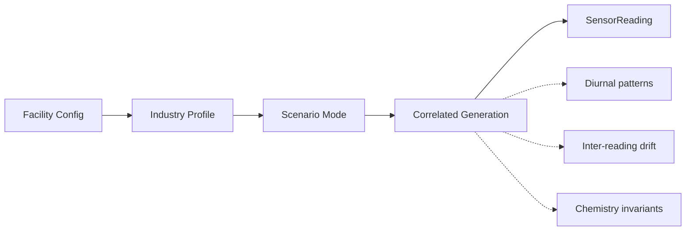

# @zeno/simulator

OCEMS sensor data generator. Produces regulatory-authentic effluent readings for 10 pre-configured facilities across 5 industry types.

## How It Works



Parameters are NOT independent. COD drives BOD (industry-specific ratio), TSS correlates with COD, HexCr <= TotalCr always, DO inversely tracks BOD.

## Scenarios

| Scenario | Pattern | Detection |
|----------|---------|-----------|
| `normal` | Mixed per facility probability | -- |
| `compliant` | All within limits | -- |
| `chronic_violator` | Always exceeds 2-3 params | Red/Orange alert |
| `tampering_flatline` | Values locked +/-1% | Yellow Alert Level I |
| `calibration_drift` | Progressive +15% drift | Trend analysis |
| `sensor_malfunction` | Spike at reading index 7 | Orange alert |
| `strategic_timing` | Compliant 9am-5pm, violating at night | AI pattern detection |
| `zld_breach` | ZLD facility with non-zero discharge | Immediate Red |
| `cetp_overload` | All params elevated 1.3-1.5x | Multiple warnings |

## Industry Profiles

| Industry | BOD/COD Ratio | Key Problem Parameters |
|----------|--------------|----------------------|
| Tannery (Kanpur data) | 0.08-0.18 | COD, Cr, BOD, TSS |
| Distillery (ZLD) | -- | Flow (any = violation) |
| Pharma | 0.15-0.25 | COD, pH, NH3-N |
| Pulp & Paper | 0.15-0.22 | COD, BOD, TSS, pH |
| Dye | 0.10-0.25 | COD, pH, Cr |

## Facilities (10)

| ID | Industry | Mode | Violation % |
|----|----------|------|------------|
| KNP-TAN-001 | Tannery | discharge | 50% |
| KNP-TAN-002 | Tannery | discharge | 30% |
| KNP-TAN-003 | Tannery | discharge | 40% |
| KNP-TAN-004 | Tannery | discharge (strict CTO) | 60% |
| KNP-TAN-005 | Tannery | discharge | 35% |
| KNP-DST-001 | Distillery | ZLD | 20% |
| KNP-PHA-001 | Pharma | discharge | 25% |
| UNN-PPR-001 | Pulp & Paper | discharge | 30% |
| KNP-DYE-001 | Dye | discharge | 35% |
| KNP-TAN-006 | Tannery | discharge | 10% |

## Usage

```typescript
import { generateSensorReading, generateBatch, generateTimeSeries, FACILITIES } from '@zeno/simulator';

const reading = generateSensorReading(FACILITIES[0]);
const batch = generateBatch(FACILITIES[0], { scenario: 'chronic_violator' });
const day = generateTimeSeries(FACILITIES[0], { startTime: new Date(), batchCount: 96 });
```

## Modules

| Module | Purpose |
|--------|---------|
| `standards.ts` | CPCB Schedule-VI limits, 17 industry categories, 6 detailed profiles |
| `facilities.ts` | 10 pre-configured facilities |
| `generators.ts` | Core generator with correlations, diurnal patterns, scenarios |

## Tests

```bash
npx tsx packages/simulator/scripts/test-generator.ts
```

113 tests: 5,000-reading invariant stress tests, rate-of-change validation, sub-ms performance benchmarks.
